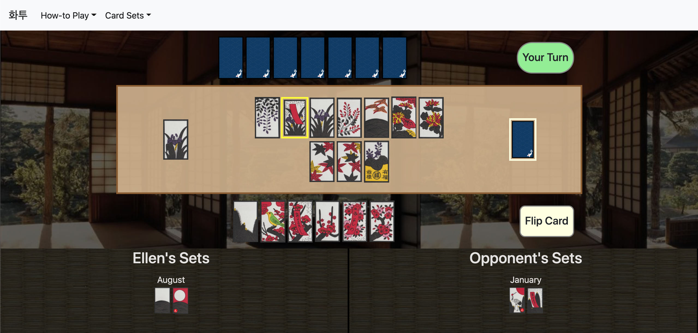

# README

## Backend
[learn-hwatu-backend](https://github.com/ellenupark/learn-hwatu-backend)

## Project Demo

[learn-hwatu.herokuapp](https://learn-hwatu.herokuapp.com/) | [Demo Video](https://www.youtube.com/watch?v=deORxiINv8I)

## Description



Play against the computer and learn how to play the Korean card game, Hwatu.
Learn Hwatu is a single page application built with a vanilla Javascript, HTML and CSS frontend.
The backend was built with Ruby on Rails (RESTful API).

## Install

### Clone Frontend and Backend Repositories

```shell
git clone git@github.com:ellenupark/learn-hwatu-frontend.git
git clone git@github.com:ellenupark/learn-hwatu-backend.git
```

### Initialize the Database

Navigate to the Backend root directory.

```shell
rails db:create 
rails db:migrate 
rails db:seed
```

### Begin Server

While in the Backend root directory,

```shell
rails s
```

### Open Application
Navigate to the Frontend root directory. Open `index.html`.

## Contributing
Bug reports and pull requests are welcome on GitHub at https://github.com/ellenupark/learn-hwatu-frontend or https://github.com/ellenupark/learn-hwatu-backend. This project is intended to be a safe, welcoming space for collaboration, and contributors are expected to adhere to the [Contributor Covenant](http://contributor-covenant.org) code of conduct.

## License

The application is available as open source under the terms of the [MIT License](https://opensource.org/licenses/MIT).

## Further Information
[Personal Website](https://ellenupark.github.io) | [LinkedIn](http://www.linkedin.com/in/ellenupark) | [Blog](https://ellen-park.medium.com/)
